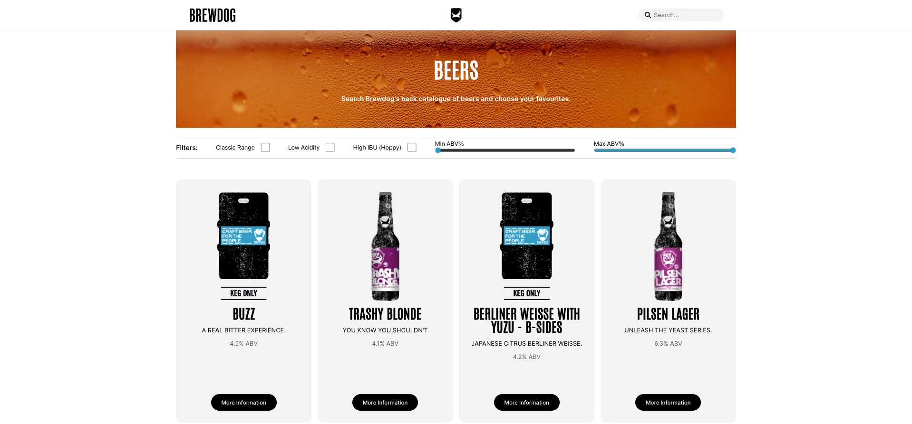

# Brewdog 'Punk Api' React App

> _A website built with React that uses the 'Punk API' to display Brewdog's back catalogue of beers. This application displays the full range of beers and allows the user to easily search and filter by selected criterias and names._  

##

## user story

- As a user of the Punk API website, I want to be able to view, search and filter Brewdog's back catalogue of beers, so that I can select an appropriate beer.
- Given that I am on the website and I have not clicked or adjusted the filters and/or entered a term into the searchbar, when I view the homepage, I would like to see all the beers available.
- Given that I am looking for a specific beer, when I enter the correct term into the searchbar, the appropriate beer should be displayed benearth the search bar.
