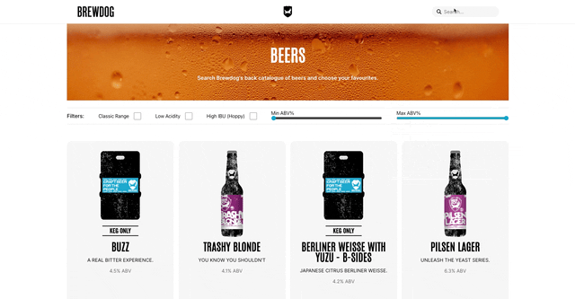

# Brewdog 'Punk Api' React App

> _A website built with React that uses the 'Punk API' to display Brewdog's back catalogue of beers. This application displays the full range of beers and allows the user to easily search and filter by selected criterias and names._  

#### Project Link [_here_](https://jpthacker.github.io/punk-api/).

##

  

## User Story

- As a user of the Punk API website, I want to be able to view, search and filter Brewdog's back catalogue of beers, so that I can select an appropriate beer.

### Acceptance Criteria

- Given that the user has not clicked or adjusted the filters and/or entered a term into the searchbar, when they view the homepage, then ensure the full range of beers are displayed in the form of cards.
- Given that the user navigates to the filters bar, when they click on the 'Classic Range' (brewed before December 2011), 'Low Acidity' (a pH below 4.2) or 'High IBU' (an IBU above 80) checkbox, then ensure the beers displayed meet the criteria.
- Given that the user navigates to the filters bar, when they click on multiple filter checkboxes, then ensure the beers displayed meet the multiple criteria.
- Given that the user navigates to the filters bar, when they adjust the min and/or max range inputs in the filters bar, then ensure the beers displayed fall within that range in terms of alchohol content (%).
- Given that the user applies filters and no beers match the criteria, when they filter their search, then ensure that an appropriate message is diplayed.
- Given that the user navigates to the search bar, when they click on the search bar, then ensure their search and the results are highlighted on the page.
- Given that the user has clicked on the searchbar, before they enter their criteria, then ensure that there are suggestions for classic and current beers in the form of cards.
- Given that the user is looking for a specific beer, when they enter the correct term into the search bar, then the ensure the appropriate beer is displayed beneath the search bar in the form of a card.
- Given that the user has clicked on the search bar, when they enter search terms without a match, then ensure an appropriate message is displayed.
- Given that the user navigates to a beer card, when they click on the card, or specifically on the 'more information' button, then ensure a new page loads with detailed information on that beer.
- Given that the user has navigated to details on a specific beer, when they click the title or logo in the nav bar, then ensure that they are directed back to the homepage.

&nbsp;

  

&nbsp;

## Installation and Setup:

To clone down this repository, you will need `node` and `npm` installed globally on your machine.  
`git clone https://github.com/jpthacker/punk-api.git`

Installation:

`npm install`

To start the server:

`npm start`

To run the app locally:

`http://localhost:3000/punk-api`

## Further Developments:

- To add context, refactoring my code to avoid complexity and excessive prop drilling.
- To add media queries, making the site responsive and usable on tablet and mobile devices.
- To introduce unit testing using React Testing Library.
